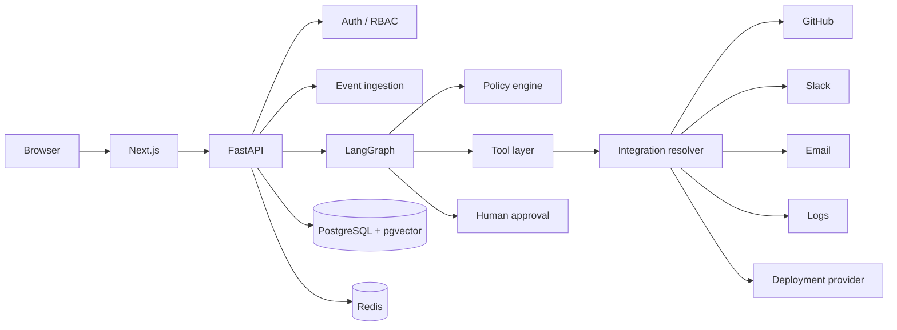

# OpsPilot AI

**AI-powered incident investigation with human-controlled remediation.**

Detect. Investigate. Explain. Approve. Resolve.

OpsPilot turns a production alert into a persisted investigation: evidence is correlated, hypotheses are scored, high-risk remediation pauses for a human, then execution and RCA are written to Postgres. It is not a chatbot and not a static dashboard.


## Why this exists

Most “AI ops” demos either fake the investigation or let a model call tools with too much trust. OpsPilot keeps the interesting part real: a fixed LangGraph, workspace tenancy, deterministic policy, human approval as a database row, and browser tests that prove approve, reject, and isolation.

## How the workflow works

```text
Event → Triage → Investigation → Evidence Correlation → Hypothesis
→ Plan → Risk Policy → Human Approval → Execution → RCA
```

Judgment (hypothesis ranking, RCA wording) may use a reasoner. Control (severity floors, risk, allowlists, whether a human must approve) is code. A model cannot relabel rollback as low risk and cannot choose an unregistered tool.

## Human-in-the-loop

High-risk rollback is a persisted approval row. The operator approves or rejects the exact `rollback_deployment` action. The UI cannot flip status.


## RCA

After a mitigating action succeeds, the incident is marked resolved and an RCA is written from persisted facts.


## Architecture




More detail: [docs/ARCHITECTURE.md](docs/ARCHITECTURE.md), [docs/AGENT_WORKFLOW.md](docs/AGENT_WORKFLOW.md), [docs/SECURITY.md](docs/SECURITY.md). Additional screenshots live in [docs/screenshots/](docs/screenshots/).

## Safety model

- The reasoner **proposes** hypotheses and actions from evidence.
- Policy **code** assigns risk. A model cannot relabel rollback as low risk.
- A **human** approves high-risk actions as a Postgres row.
- **Tools** execute through adapters. Demo adapters are labeled Simulation and do not contact real vendors.

## Tech stack

| Area | Choice |
| --- | --- |
| Frontend | Next.js, TypeScript, Tailwind |
| Backend | FastAPI, SQLAlchemy 2 async, Alembic |
| AI | LangGraph, deterministic reasoner, optional RCA rewrite |
| Data | PostgreSQL 16, pgvector |
| Realtime | Redis pub/sub, SSE stream tickets |
| Infrastructure | Docker Compose, GitHub Actions |
| Testing | pytest, ruff, mypy, Playwright |

## Key engineering features

Multi-tenant workspace isolation · RAG over prior incidents · LangGraph orchestration · HITL approval · SSE · Redis · secret vault · idempotent execution · workflow recovery · audit logs · observability · evaluation suite · CI including browser E2E

## Local setup

```bash
docker compose up --build
```

- Console: http://localhost:3000
- API: http://localhost:8000/docs

Or without Compose: Python 3.12, Node 22, PostgreSQL with pgvector, Redis. Copy `.env.example` to `.env`.

```bash
cd backend
python3.12 -m venv .venv
.venv/bin/pip install -e ".[dev]"
.venv/bin/alembic upgrade head
.venv/bin/uvicorn app.main:app --reload

cd ../frontend
npm install
npm run dev
```

## Try the demo

AcmeFlow is a **fictional** company. The demo workspace uses simulation adapters. They persist real investigation rows; they do not call live GitHub, Slack, email, or deploy systems.

```bash
export OPSPILOT_DEMO_SEED_ENABLED=true
python scripts/seed_demo.py
```

That creates organization `AcmeFlow`, workspace `AcmeFlow Production`, and operator `Alex Morgan` (Incident Commander). Reset live incidents with `python scripts/reset_demo.py` without deleting history or the demo user.

Open the console, click **Try Demo**, then **Run Incident Scenario**. That path uses the same ingest → graph → approval → execution → RCA pipeline as a registered workspace.

Never enable demo seed in production. The flag is off by default.

Full walkthrough: [docs/DEMO.md](docs/DEMO.md).

## Testing

GitHub Actions on `main` runs backend lint/types/migrate/pytest, frontend typecheck/lint, and Playwright against PostgreSQL + Redis + FastAPI + Next.js. Coverage includes the AcmeFlow demo path plus approve, reject, and workspace isolation.

```bash
# backend
cd backend && ruff check app tests && mypy app && pytest -q
python -m app.evaluation.runner

# frontend
cd frontend && npm run typecheck && npm run lint

# browser (starts local API + console)
bash scripts/run-e2e.sh
```

Screenshot capture is opt-in: `CAPTURE_SCREENSHOTS=1 bash scripts/run-e2e.sh e2e/capture-screenshots.spec.ts`.

## Security

JWT sessions, hashed ingest keys, workspace-scoped queries, AES-256-GCM vault, audit trail, rate limits. Demo sessions cannot create keys, connect real integrations, or change workspace security.

See [SECURITY.md](SECURITY.md) to report a vulnerability and [docs/SECURITY.md](docs/SECURITY.md) for the architecture.

## Roadmap

See [ROADMAP.md](ROADMAP.md).

## License

MIT. AcmeFlow services, customers, and Git history are fictional.
