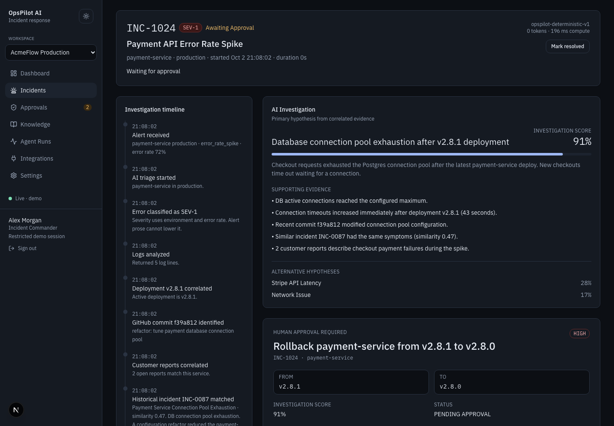
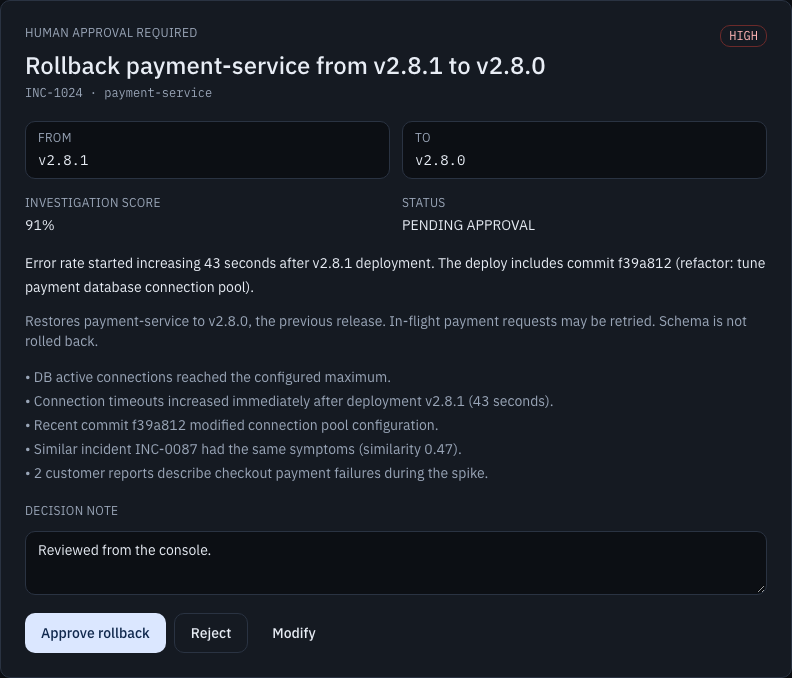
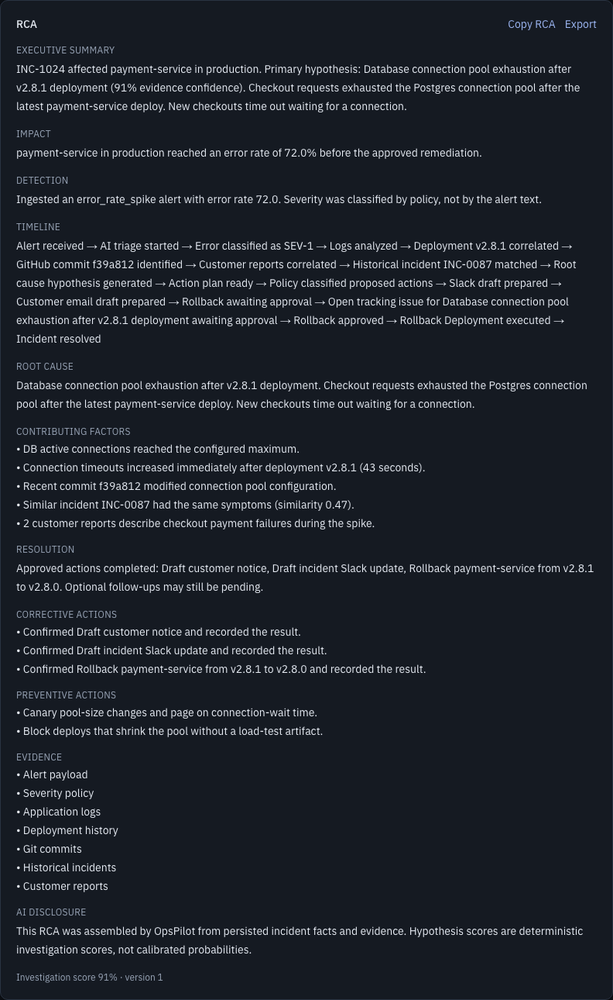
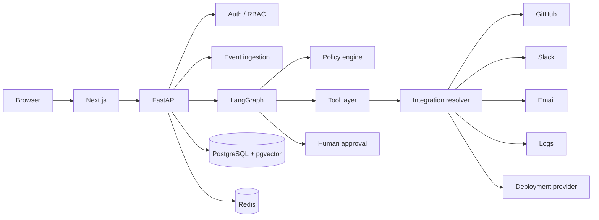
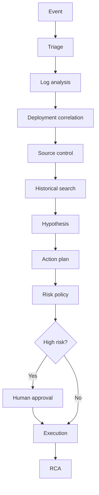

# OpsPilot AI

**AI-powered incident investigation with human-controlled remediation.**

Detect. Investigate. Explain. Approve. Resolve.

OpsPilot is an incident-response and operations automation platform. It is not a chatbot and not a static dashboard. An alert becomes a persisted investigation: evidence is correlated, a hypothesis is scored, high-risk remediation pauses for a human, then execution and RCA are written to Postgres.



## Why I Built This

What happens when an AI agent is allowed to investigate a real production incident—but not blindly execute dangerous actions?

Most “AI ops” demos either fake the investigation or let a model call tools with too much trust. OpsPilot keeps the interesting part real: a fixed LangGraph, workspace tenancy, deterministic policy, human approval as a database row, idempotent adapters, and a browser E2E that proves approve, reject, and isolation.

## Demo

The 60–90 second walkthrough has not been published yet. Record it from the seeded AcmeFlow path; do not invent a video link here.

▶ Watch the 90-second demo — *URL added after the recording is uploaded.*

Recording notes: [docs/showcase/RECORDING_RUNBOOK.md](docs/showcase/RECORDING_RUNBOOK.md). Script and captions: [DEMO_SCRIPT.md](docs/showcase/DEMO_SCRIPT.md), [VIDEO_CAPTIONS.md](docs/showcase/VIDEO_CAPTIONS.md).

```bash
export OPSPILOT_DEMO_SEED_ENABLED=true
python scripts/seed_demo.py
python scripts/reset_demo.py
```

Open the console, click **Try Demo**, then **Run Incident Scenario**. That path uses the same ingest → graph → approval → execution → RCA pipeline as a registered workspace.

## Human-in-the-loop

High-risk rollback is a persisted approval row. The model cannot relabel it as low risk. The operator approves or rejects the exact `rollback_deployment` action.



## RCA / Resolution

After execution, the incident is marked resolved and an RCA is written from persisted facts.



## Core Workflow

```text
Event → Triage → Investigation → Evidence Correlation → Hypothesis
→ Plan → Risk Policy → Human Approval → Execution → RCA
```

## Architecture






More detail: [docs/ARCHITECTURE.md](docs/ARCHITECTURE.md), [docs/AGENT_WORKFLOW.md](docs/AGENT_WORKFLOW.md), [docs/SECURITY.md](docs/SECURITY.md). The AcmeFlow dashboard and agent-run inspector live in [docs/screenshots/](docs/screenshots/) (`01-dashboard.png`, `07-agent-run.png`). Capture notes: [docs/showcase/SCREENSHOTS.md](docs/showcase/SCREENSHOTS.md).

## Safety Model

- The reasoner **proposes** hypotheses and actions from evidence.
- Policy **code** assigns risk. A model cannot relabel rollback as low risk.
- A **human** approves high-risk actions as a Postgres row.
- **Tools** execute through adapters. Demo adapters are labeled Simulation.

## Tech Stack

| Area | Choice |
| --- | --- |
| Frontend | Next.js, TypeScript, Tailwind |
| Backend | FastAPI, SQLAlchemy 2 async, Alembic |
| AI | LangGraph, deterministic reasoner, optional RCA rewrite |
| Data | PostgreSQL 16, pgvector |
| Realtime | Redis pub/sub, SSE stream tickets |
| Infrastructure | Docker Compose, GitHub Actions |
| Testing | pytest, ruff, mypy, Playwright |

## Key Engineering Features

Multi-tenant workspace isolation · RAG over prior incidents · LangGraph orchestration · HITL approval · SSE · Redis · secret vault · idempotent execution · workflow recovery · audit logs · observability · evaluation suite · production CI including browser E2E

## Testing

GitHub Actions on `main` runs backend lint/types/migrate/pytest, frontend typecheck/lint, and Playwright against PostgreSQL + Redis + FastAPI + Next.js.

Snapshot from the `v0.1.0-core` baseline: backend **51** pytest cases and **3** Playwright scenarios (approve, reject, workspace isolation). `main` also runs the AcmeFlow demo showcase. Screenshot capture is opt-in (`CAPTURE_SCREENSHOTS=1`). Counts can move; CI is the source of truth.

## Local Setup

```bash
docker compose up --build
```

- Console: http://localhost:3000
- API: http://localhost:8000/docs

Or without Compose: Python 3.12, Node 22, PostgreSQL with pgvector, Redis. Copy `.env.example` to `.env`.

```bash
cd backend
python3.12 -m venv .venv
.venv/bin/pip install -e ".[dev]"
.venv/bin/alembic upgrade head
.venv/bin/uvicorn app.main:app --reload

cd ../frontend
npm install
npm run dev
```

## Demo Setup

```bash
export OPSPILOT_DEMO_SEED_ENABLED=true
python scripts/seed_demo.py
```

That creates organization `AcmeFlow`, workspace `AcmeFlow Production`, and operator `Alex Morgan` (Incident Commander, not admin). Reset live incidents with `python scripts/reset_demo.py` without deleting history or the demo user.

Never enable demo seed in production. The flag is off by default.

## Security

JWT sessions, hashed ingest keys, workspace-scoped queries, AES-256-GCM vault, audit trail, rate limits. Demo sessions cannot create keys, connect real integrations, or change workspace security. See [docs/SECURITY.md](docs/SECURITY.md) and [docs/SECURITY_REVIEW.md](docs/SECURITY_REVIEW.md).

## Roadmap

- Queue worker in front of the same workflow
- Hosted embeddings behind the existing interface
- Public repository + recorded demo after a final review

## License

MIT. AcmeFlow services, customers, and Git history are fictional.
