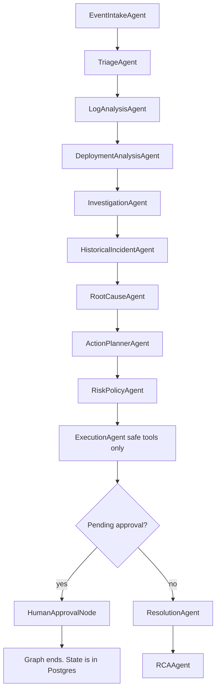
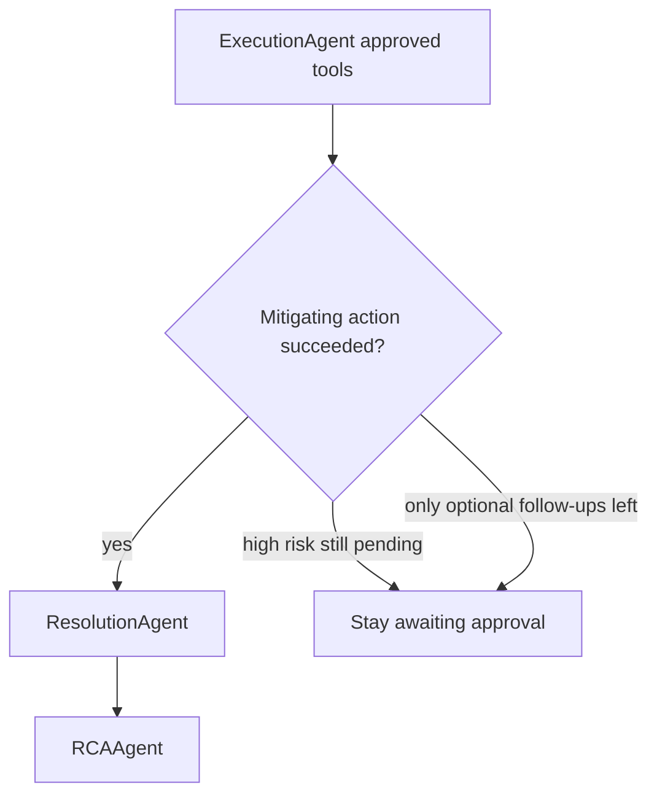

# Agent workflow

The investigation is one LangGraph. Nodes are specialized and run in a fixed order. A node does not choose the next node, except the single policy gate that either waits for a human or resolves.

Tenancy: the graph is invoked with `incident_id`. Every load and write is in that incident’s workspace. Tools receive `workspace_id` through the execution context. Production auth is described in [AUTH.md](AUTH.md); this file does not define login.

The LinkedIn pool-exhaustion story below is a **test and later seed scenario**. It is not the default product configuration.

After a human approves or rejects, a second graph resumes:

## What each node does

| Node | Work | Side effects |
| --- | --- | --- |
| EventIntakeAgent | Loads the incident created by the API. Marks activity as analyzing. | Timeline only |
| TriageAgent | Severity from environment and error rate. Flags instruction-like alert text. | Incident severity |
| LogAnalysisAgent | `search_logs` | Read |
| DeploymentAnalysisAgent | `get_recent_deployments` | Read |
| InvestigationAgent | `get_recent_commits`, `search_customer_reports` | Read |
| HistoricalIncidentAgent | `search_previous_incidents` via pgvector | Read |
| RootCauseAgent | Ranked hypotheses with evidence bullets | Writes `incident_hypotheses` |
| ActionPlannerAgent | Proposed tools and arguments from the primary hypothesis | None external |
| RiskPolicyAgent | Assigns LOW / MEDIUM / HIGH. Opens approval rows. Ignores any model-suggested risk. | Approval rows |
| ExecutionAgent | Runs tools that are allowed. Safe pass: drafts. Resume pass: approved rows. | Allowlisted tools |
| HumanApprovalNode | Sets `awaiting_approval`, writes a checkpoint, stops the graph. | No tool |
| ResolutionAgent | Sets resolved when a mitigating tool succeeded, the case is a false positive, or an operator resolves it. | Status |
| RCAAgent | Writes the RCA sections and indexes the incident into memory. | Knowledge row |

## State

`IncidentState` is a TypedDict carried by the graph: incident id, event, evidence lists, hypotheses, recommended actions, flags for approval and auto-resolve, model name, token counts, errors.

The UI does not read this dict. It reads tables. Each node commits before the graph continues, so a refresh mid-run shows partial progress.

## Demo storyline (database connection pool)

1. `POST /api/v1/events` for `payment-service`, error rate 72, message `Database connection timeout`.
2. Severity becomes SEV-1 because production and rate ≥ 50.
3. Logs show the pool at `active=50 max=50`.
4. Deployment `v2.8.1` is 43 seconds before the alert.
5. Commit `f39a812` refactors the connection pool.
6. Retrieval returns `INC-0087`.
7. Primary hypothesis is DB connection pool exhaustion.
8. Planner proposes rollback `v2.8.1` → `v2.8.0`, a GitHub issue, and local drafts.
9. Policy marks rollback HIGH and the issue MEDIUM. Both wait. Drafts run locally and do not notify anyone.
10. The graph ends. Status is `awaiting_approval`.
11. `POST /api/v1/approvals/{id}/approve` locks the row, marks it approved, and resumes execution.
12. Demo rollback reports success. The mitigating tool triggers resolution and an RCA.

Rejecting the rollback leaves the incident open. A draft approval never calls `send_slack_message` or `send_customer_email`.

## False positive

Error rate under 5, or a flap/false-positive event, is SEV-4. The planner proposes no side effects. The gate resolves and writes an RCA that says no fault was found.

## Failure behavior

A node exception is stored on the agent step and the incident `last_error`. The run status becomes `failed`. The API does not report the incident as resolved.

## Adding a tool

1. Add a Pydantic args model with `extra=forbid`.
2. Register the tool in the catalog. Unregistered names cannot run.
3. Add the risk in `RiskPolicyService`. There is no default risk.
4. If it writes outside OpsPilot, `requires_approval` must be true.
5. Constrain arguments with an allowlist checked in the policy service, not in the prompt.
6. Add an eval or policy test.

Do not add a tool that takes a command string.
