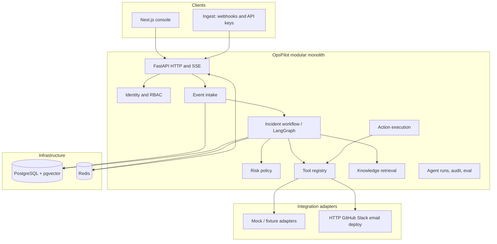

# OpsPilot AI — System Architecture

**Product:** OpsPilot AI  
**Identity:** Autonomous AI Incident Response & Operations Platform

OpsPilot is a modular monolith that turns a production event into a governed investigation: triage, evidence, hypotheses, a risk-classified action plan, human approval, execution, resolution, and RCA. It is not a customer-support chatbot and it is not a free-form tool loop.

This document records the architecture for the **production product**. A seeded demo workspace is a late phase. It must not define the domain model.

Existing code already implements the investigation graph, policy engine, tools, RAG, and SSE on a single FastAPI process. That core is kept. The production architecture adds tenancy, authentication, authorization, and swappable workers and LLM providers around it.

---

## Approaches considered

### Approach A — Demo-optimized single tenant (current repository)

One FastAPI process, optional shared API key, `X-Operator` as a free-text actor, `OPSPILOT_MODE=demo|real`, in-process worker, hashing embedder, deterministic reasoner.

**Strengths:** `docker compose up` tells a complete incident story. Policy vs reasoning split is already correct.

**Weaknesses:** No users, organizations, or RBAC. Ingest is effectively open when the API key is empty. Historical incidents and knowledge are global. Not a SaaS boundary another engineer can extend into OAuth or billing.

**Verdict:** Keep the investigation and policy design. Do not keep this as the product architecture.

### Approach B — Modular monolith with workspace tenancy (recommended)

One deployable API. Postgres is the system of record. Redis is cache and fan-out. Domain packages stay in-process. Organizations and workspaces are first-class. Users authenticate with email/password JWTs. Ingest uses workspace API keys. The investigation remains a fixed LangGraph. Risk policy remains code. Integrations and LLM providers are protocols with mock and real adapters.

**Strengths:** Matches “one senior engineer can extend it.” Matches the required development order. Horizontal workers are a later swap behind an already-defined `IncidentWorker` interface. SSO is a new identity provider row, not a rewrite.

**Weaknesses:** One process still runs HTTP and work until a queue is introduced. That is accepted for v1.

**Verdict:** Selected.

### Approach C — Microservice mesh

Separate ingest, auth, worker, RAG, and policy services with an event bus between them.

**Strengths:** Independent scale of workers vs API.

**Weaknesses:** Forbidden for this product. It would split the incident transaction, duplicate authorization, and inflate ops for a greenfield team.

**Verdict:** Rejected.

---

## Selected shape



The API acknowledges an incident as soon as the row exists. Investigation runs through a worker interface. Today that is an in-process task. Tomorrow it can be a Redis/queue consumer. The workflow must not know which.

Postgres is authoritative for incidents, approvals, tool results, audit, and identity. Redis publishes invalidation events for the console. If Redis is down, a single node may fall back to an in-memory bus. Multi-node production requires Redis.

---

## Bounded contexts (packages, not services)

| Package | Responsibility | Must not |
| --- | --- | --- |
| `identity` | Users, orgs, workspaces, sessions, API keys, RBAC | Run tools or the graph |
| `api` | HTTP, validation, auth dependencies | Embed risk or tool allowlists |
| `incidents` | Intake, lifecycle, read models | Call third-party APIs |
| `agents` / `graphs` | Ordered investigation and resume | Invent tool risk |
| `policies` | Risk, argument allowlists, approval requirement | Call the network |
| `tools` | Typed execution behind a registry | Accept a shell string or unknown name |
| `execution` | Run approved actions, record results | Bypass policy |
| `rag` | Chunking, embeddings, retrieval | Approve actions |
| `integrations` | Adapters selected by config, not by the model | Be invoked except through tools |
| `observability` | Runs, steps, tool calls, costs | Store secrets or chain-of-thought |
| `audit` | Append-only actor/resource records | Be editable from the UI |
| `evaluation` | Scenario scorecards | Depend on a live LLM |

---

## Core workflow (product, not UI copy)

```text
Production Event
→ Detection / intake
→ AI Triage
→ Investigation
→ Evidence Correlation
→ Root Cause Hypothesis
→ Action Planning
→ Risk Policy
→ Human Approval
→ Action Execution
→ Resolution Tracking
→ RCA Generation
```

Judgment (hypothesis ranking, RCA wording) may use a reasoning provider. Control (severity floors, risk, allowlists, whether a human must approve) is code. A model cannot relabel rollback as low risk and cannot choose an unregistered tool.

---

## Trust boundaries

1. **Browser** never receives LLM keys, integration tokens, or webhook secrets.
2. **User JWT** authorizes console and operator actions. It cannot ingest unsigned production alerts.
3. **Workspace API keys** authorize ingest only, with scoped permissions (`events:write`).
4. **Policy service** is the only writer of `risk_level` on planned actions.
5. **Tool registry** is the only path to GitHub, Slack, email, rollback, or restart.
6. **Approval row in Postgres** is the only path from a HIGH action to execution. The UI cannot flip status.

---

## Process model

v1: one FastAPI process serves HTTP, SSE, and the worker.

v1.1 (same codebase): `OPSPILOT_WORKER_MODE=inline|queue`. Queue mode consumes jobs from Redis. No new repository.

Approvals use `SELECT … FOR UPDATE` so two operators cannot both approve.

---

## What stays from the current codebase

- Fixed LangGraph investigation, pause by returning, resume from Postgres
- Policy table, typed tools, no generic execute endpoint
- SSE as wake-up; REST as the read model
- Deterministic reasoner as the default so CI and local runs need no vendor key
- pgvector knowledge plus an `Embedder` protocol
- Demo/real integration adapters behind the same tool interface

## What changes

- Organizations, workspaces, users, RBAC, refresh tokens, SSO-ready identity tables
- Email/password as the primary login; optional API key is no longer the product auth story
- All incident and knowledge rows are workspace-scoped
- LLM provider protocol (OpenAI, Anthropic, Gemini, Ollama) for **narrative and optional synthesis only** unless a future flag explicitly allows more
- Audit and observability always recorded, including identity of the actor
- Seeded LinkedIn demo workspace is phase 23, not the default runtime

---

## Intentionally later (not stubbed as if they work)

- Automatic promotion of a Slack draft into a send
- OpenTelemetry export (phase 22 may add exporters; not required for domain correctness)
- Billing
- Horizontal autoscaling of workers
- Full OIDC login UI (schema and interfaces land with auth; flows land when SSO is implemented)
