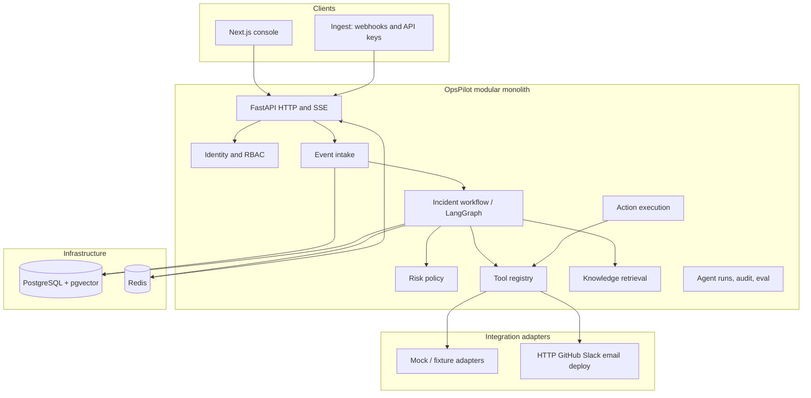
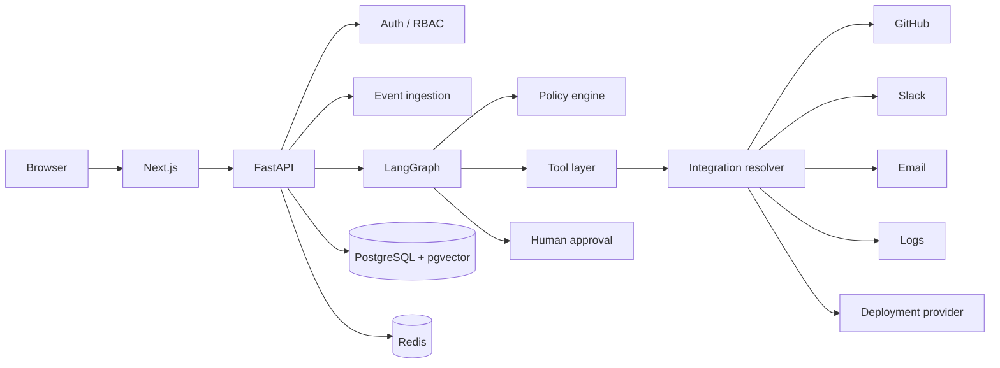
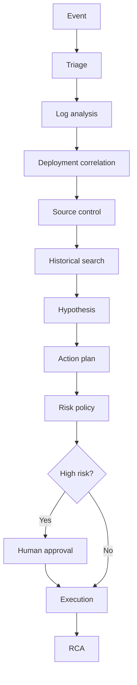

# OpsPilot AI — System Architecture

**Product:** OpsPilot AI  
**Identity:** Autonomous AI Incident Response & Operations Platform

OpsPilot is a modular monolith that turns a production event into a governed investigation: triage, evidence, hypotheses, a risk-classified action plan, human approval, execution, resolution, and RCA. It is not a customer-support chatbot and it is not a free-form tool loop.

The domain model is workspace-scoped production incidents. The optional AcmeFlow demo uses the same graph and policy; it does not define the product.

---

## Approaches considered

### Approach A — Demo-optimized single tenant

One FastAPI process, optional shared API key, free-text operator header, global incidents, no RBAC.

**Strengths:** A single compose file can tell an incident story. Policy vs reasoning split can still be correct.

**Weaknesses:** No users, organizations, or SaaS boundary. Ingest is effectively open when the API key is empty. Historical knowledge is global.

**Verdict:** Rejected as the product architecture. The investigation and policy design were kept.

### Approach B — Modular monolith with workspace tenancy

One deployable API. Postgres is the system of record. Redis is cache and fan-out. Domain packages stay in-process. Organizations and workspaces are first-class. Users authenticate with email/password JWTs. Ingest uses workspace API keys. The investigation remains a fixed LangGraph. Risk policy remains code. Integrations and LLM providers are protocols with mock and real adapters.

**Strengths:** One engineer can extend it. Horizontal workers later swap behind `IncidentWorker`. SSO is a new identity-provider row, not a rewrite.

**Weaknesses:** One process still runs HTTP and work until a queue is introduced. Accepted for v1.

**Verdict:** Selected. This is the current architecture.

### Approach C — Microservice mesh

Separate ingest, auth, worker, RAG, and policy services with an event bus.

**Strengths:** Independent scale of workers vs API.

**Weaknesses:** Splits the incident transaction, duplicates authorization, and inflates operations for a greenfield team.

**Verdict:** Rejected.

---

## Selected shape



The API acknowledges an incident as soon as the row exists. Investigation runs through a worker interface. Today that is an in-process task. A queue consumer can replace it later. The workflow must not know which.

Postgres is authoritative for incidents, approvals, tool results, audit, and identity. Redis publishes invalidation events for the console. If Redis is down, a single node may fall back to an in-memory bus. Multi-node production requires Redis.

---

## Bounded contexts (packages, not services)

| Package | Responsibility | Must not |
| --- | --- | --- |
| `identity` | Users, orgs, workspaces, sessions, API keys, RBAC | Run tools or the graph |
| `api` | HTTP, validation, auth dependencies | Embed risk or tool allowlists |
| `incidents` | Intake, lifecycle, read models | Call third-party APIs |
| `agents` / `graphs` | Ordered investigation and resume | Invent tool risk |
| `policies` | Risk, argument allowlists, approval requirement | Call the network |
| `tools` | Typed execution behind a registry | Accept a shell string or unknown name |
| `execution` | Run approved actions, record results | Bypass policy |
| `rag` | Chunking, embeddings, retrieval | Approve actions |
| `integrations` | Adapters selected by config, not by the model | Be invoked except through tools |
| `observability` | Runs, steps, tool calls, costs | Store secrets or chain-of-thought |
| `audit` | Append-only actor/resource records | Be editable from the UI |
| `evaluation` | Scenario scorecards | Depend on a live LLM |

---

## Core workflow

```text
Production Event
→ Detection / intake
→ AI Triage
→ Investigation
→ Evidence Correlation
→ Root Cause Hypothesis
→ Action Planning
→ Risk Policy
→ Human Approval
→ Action Execution
→ Resolution Tracking
→ RCA Generation
```

Judgment (hypothesis ranking, RCA wording) may use a reasoning provider. Control (severity floors, risk, allowlists, whether a human must approve) is code. A model cannot relabel rollback as low risk and cannot choose an unregistered tool.

---

## Trust boundaries

1. **Browser** never receives LLM keys, integration tokens, or webhook secrets.
2. **User JWT** authorizes console and operator actions. It cannot ingest unsigned production alerts.
3. **Workspace API keys** authorize ingest only, with scoped permissions (`events:write`).
4. **Policy service** is the only writer of `risk_level` on planned actions.
5. **Tool registry** is the only path to GitHub, Slack, email, rollback, or restart.
6. **Approval row in Postgres** is the only path from a HIGH action to execution. The UI cannot flip status.

---

## Process model

v1: one FastAPI process serves HTTP, SSE, and the worker.

Same codebase later: `OPSPILOT_WORKER_MODE=inline|queue`. Queue mode consumes jobs from Redis.

Approvals use `SELECT … FOR UPDATE` so two operators cannot both approve.

---

## Runtime contracts that are already in place

- Fixed LangGraph investigation, pause by returning, resume from Postgres
- Organizations, workspaces, users, RBAC, refresh tokens
- Workspace-scoped incidents and knowledge
- Typed tools, no generic execute endpoint
- SSE as wake-up; REST as the read model
- Deterministic reasoner as the default so CI and local runs need no vendor key
- Optional LLM rewrite of narrative fields only (`LlmClient` cannot call tools)
- pgvector knowledge plus an `Embedder` protocol
- Mock and real integration adapters behind the same tool interface
- Opt-in demo workspace via `OPSPILOT_DEMO_SEED_ENABLED` and `scripts/seed_demo.py`

---

## Current runtime diagram





---

## Intentionally later

See [ROADMAP.md](../ROADMAP.md). Not stubbed as if they already work: Slack draft auto-send, OpenTelemetry export, billing, horizontal worker autoscaling, OIDC login UI.
